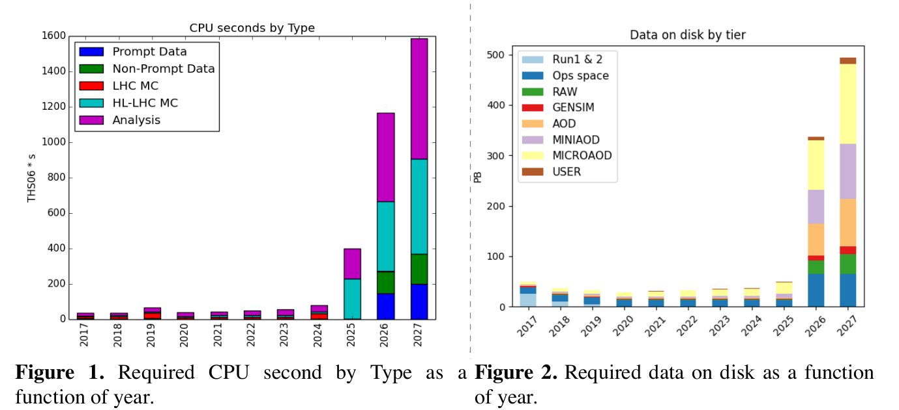
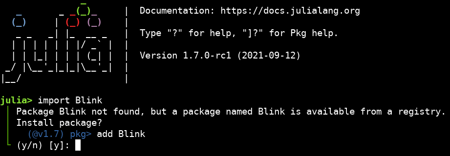
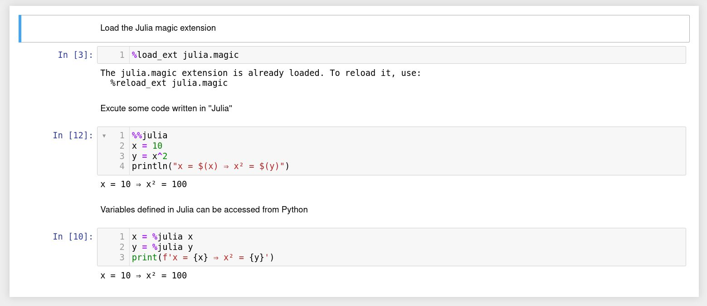

[](https://mybinder.org/v2/gh/grasph/JIII2021Talk/HEAD?filepath=01-Julia-dream-JIII2021.ipynb)

# Talk to be presented at [13<sup>e</sup>Journées informatiques IN2P3/Irfu](https://indico.in2p3.fr/event/25008/timetable/)

The presentation was written as a Jupyter(lab) notebook. For an interactive presentation, click on the binder badge above or [here](https://mybinder.org/v2/gh/grasph/JIII2021Talk/HEAD?filepath=01-Julia-dream-JIII2021.ipynb). The static version follows. The presentation notebook (01-Julia-dream-JIII2021.ipynb) and the accompagning ones can be downloaded from this repository.

----------

# 13e Journées Informatiques IN2P3/IRFU
<span style="position:absolute;top:0px;right:20px;"></span>

----------

<br/><br/><br/>


<div style="height:300px;">
<div style="margin-left:10%;">
    
<h1>Julia, a HEP dream comes true</h1>
<h2 style="font-style:italic;margin-top:0.3em;">Julia, un rêve HEP se réalise</h2>
<br/>
Philippe Gras (Université Paris-Saclay, CEA/Irfu)
    </div>


<div style="position:absolute; bottom:10px;">November 16th, 2021</div>
</div>

# Introduction

* Julia is a relatively new __programming language__
<br/><br/>
* Let's start with few words on the context...

# High performance computing is important for HEP

<div style="display:flex;">
    <div style="width:25%;">
    <div><a href="https://doi.org/10.1088/1742-6596/1085/2/022006">From E Sexton-Kennedy 2018 J. Phys.: Conf. Ser. 1085 022006</a><br/>
        THS06*s: Tera CPUs $\times$ s<br/><br/><br/>
</div>
</div>
    <div style="width:70%;"></div>
</div>

   * Computing plays a central role in the research done at LHC
     + Theoretical predictions: simulation of the proton-proton collisions
     + Simulation of the detector response
     + Reconstruction of the phyics events
     + Analysis of reconstructed events to perform measurements and new physics search.

# Analysis of the reconstructed events
  * Behind an LHC experiment result publication there are <b>tens of thousands</b> of computing jobs that have run on the worldwide computing grid. Both ATLAS and CMS reached their 1000th papers in June 2020.
   * Research code: developed by the main authors of the prepared publication
   * C++ is widely used and the performance it offers is essential
   * More and more combined with Python, that provides easy/fast coding it offers, and comes with an extensive library ecosystem. But it does not meet the performance provided by C++
   * <span style="color:darkgreen;font-weight:bold;">A programming language that offers at the same time the C++ and Python pros would be more convenient</span>

# Julia solving the two-language problem
-----

   <center>
       <table style="font-size:25px;background:inherit;">
   <tr><th style="text-align:center;">Fast/easy coding fast</th><th></th><th style="text-align:center;">Fast running</th></tr>
   <tr><td style="text-align:center;">Python                </td><td>⇔</td><td style="text-align:center;">C/C++</td></tr>
   </table>    
   ⇒  Mixing languages and Go back-and-forth between them
   </center>

<br/>

* J. Bezanson, A. Edelman, S. Karpinski, and V. B. Shah tackled the problem in 2009 aiming to design a programing langue that providess both Fast/easy coding __AND__ Fast running
   + Birth of Julia,  release 0.1 in __2013__ 
   + This breakthrough was recognized by awards attributed to the authors
      - [James H. Wilkinson Prize in Numerical Analysis and Scientific in 2019](https://www.ll.mit.edu/news/wilkinson-prize-goes-developers-flexible-julia-programming-language) 
      - [IEEE Computer Society Sidney Fernbach Award in 2019](https://www.computer.org/press-room/2019-news/2019-ieee-fernbach-award-edelman)
* In 12 years since its conceptualisation, Julia has been improved from release to release and has aggratated many package developers

* Julia for HEP: [Performance of Julia for High Energy Physics Analyses, Marcel Stanitzki & Jan Strube](https://link.springer.com/article/10.1007/s41781-021-00053-3)


      
<div style="border: 5px darkgreen; border-style: none none none solid; padding:10px;margin-left:30px;">
    <h3>Nowadays, Julia is a mature language, with a wide ecosystem</h3>
    </div>
</div>


# Loops

<center>

</center>

# HEP data analysis is a looping game

HEP enjoys loop: we loop on physics events to loop on particles/physics objects. We often perform particle matching and clustering and for this we loop on events to loop on objects to loop on objects.

```julia
for event in billions_of_lhc_events
    for tens_or_hundreds_of_objects in event
        for tens_or_hundres_of_objects_to_match in event
            ...
        end
    end
end
```

 * The outer loops hides several loops: datasets > files
 * This is repeated several times for each analysis.
<p style="margin-left:2em;"> ⇒ Lines of code executed billions of times even for a Kleenex code, written specially for a publication.</p>

## Python dislikes loop

 * A master rule for high-performance code in Python is to avoid writing loop in Python 
    + ⇒ push the loop to underlying compiled libraries. Approach of the `numpy` vectorisation.
 
Let's run a simple loop
 
[Simple loop in Python](Python-code.ipynb#simple-loop)

| Python |
|--------|
|  45 ms |

## In C++. Code in `simple-loop.cc`:

```cpp
#include <iostream>
#include <sys/time.h>x

int main(){
  struct timeval t0, t1;
  gettimeofday(&t0, 0);
    
  double a = 0.;
  for(unsigned i = 0; i <= 1000000; ++i) a += 1.0/i;
  std::cout << "Computation Result: " << a << "\n";
  
  gettimeofday(&t1, 0);
  std::cerr << "Duration: " << (t1.tv_sec-t0.tv_sec)
    + 1.e-6*(t1.tv_usec-t0.tv_usec)
	    << " seconds\n";
  return 0;
}
```


```julia
run(`g++ -Wall -o simple-loop simple-loop.cc`)
run(`./simple-loop`)
;
run(`g++ -O3 -Wall -o simple-loop simple-loop.cc`)
run(`./simple-loop`)
;
```

    Computation Result: 14.3927
    Computation Result: 14.3927


    Duration: 0.003238 seconds
    Duration: 0.001518 seconds


| Python |  C++  |
|--------|-------|
| 45 ms  | 1.0 ms |

## How is doing Julia?


```julia
#
# Julia
#
function f()
    a = 0.0
    for i in 1:1_000_000 # ✨ Note the underscores that improves legibility
       a = a + 1.0/i
    end
    return a
end
f()
@time b = f()
```

      0.001369 seconds (1 allocation: 16 bytes)


    14.392726722864989


| Python  | C++    | Julia  |
|---------|--------|--------|
|  45 ms  | 1.0 ms | 1.0 ms |

# Ease of programming

## The goal is not only running performance. We want also fast and easy coding.

   * You have already seen in the previous example that the code syntax and grammar is similar to Pythons. No ''std::map<std:string, std::vector<MyClass>>''..., no compilation step.
   * Easy to learn
   * Syntactic sugars similar to Python for a concise code: list comprehension, a &lt; b &lt; c, 1_000_000, support of symbols for variables...
    and more: e.g. a function call is "vectorized" (ala numpy) with a simple dot, f.(x)
   * Interactive help, nice tools to debug, to optimize code, for introspection.
   * Multidispatch eases remarkably use/extension of third-party libraries → explains the rapid grow of the Julia ecosystem.

# Programming in a community

## Googling programming

Internet search engine and stack overflow play is an essential ingredient in nowadays programming workflow.

Julia is already widespread enough, to find all the information on the Internet.<br/>

In addition to usual resource, Julia has dedicated forum on [Discourse](https://discourse.julialang.org/), [Slack](https://julialang.org/slack/), and [Zulip](https://julialang.zulipchat.com/) with an active and friendly community.

Go to [DuckDuckGo](https://www.duckduckgo.com) or your prefered search engine and make a try.


## Ecosystem

* Large set of libraries and active developement
   + Julia is firstly used by scientific community  ⇒ oriented to our needs
* I did the following game during the [PyHEP2021 workshop](https://indico.cern.ch/event/1019958/): I've looked for a Julia equivalent each time a speaker mention a Python library (apart from HEP specific ones).
   + Caveat: I've not checked that it covers all the features of the Python package
   + The results of this survey shows the large activity around Julia

cmd (Olivier Mattelaer) ✓<br/>
FreeCAD interface (Christophe Delaere) ❌ [In discussion](https://forum.freecadweb.org/viewtopic.php?f=8&t=42400&sid=77306c4ad6e62533dfbf06909b06c0c8&start=10)<br/>
Telegram bot (Matias Senge) ✓ https://github.com/Arkoniak/Telegram.jl<br/>
DataFrames (Vincenzo Eduardo Padulano)  ✓<br/>
Spark (Vicenzo and Andr F.)  ✓ https://github.com/dfdx/Spark.jl<br/>
Dask (Vincenzo E. P., Graham Markal) ✓<br/>
Batch computing (Vincenzo E. P.)  ✓ https://docs.julialang.org/en/v1/manual/parallel-computing/, https://github.com/JuliaParallel, https://juliagpu.org/<br/>
Apache Parquet  (Andre Frankenthal)  ✓<br/>
Jupyter/Binder/SWAN ✓<br/>
Bokeh (Bruno Alves)  ✓ https://github.com/samuelcolvin/Bokeh.jl<br/>
CUDA (Graham Markall) ✓ https://juliagpu.org/cuda/<br/>
Hypothesis (Santam Roy Choudhury, property testing)  ❌ ([beside an unmaintained QuickCheck projet](https://quickcheckjl.readthedocs.io/))<br/>
Virtualenv (Henry Schneider, Packaging talk) ✓ [built in the std package manager](https://pkgdocs.julialang.org/v1/environments/)<br/>
Unit test tools (Henry Schneider, Packaging talk)  ✓ [std package](https://docs.julialang.org/en/v1/stdlib/Test/) and more: [Coverage](https://github.com/JuliaCI/Coverage.jl), [FactCheck](https://github.com/JuliaAttic/FactCheck.jl)<br/>
JIT/Numba (Graham Markal, Henry Schneider) ✓ [Intrisic to the language](https://docs.julialang.org/en/v1/#man-introduction)<br/>
Machine learning ✓ [Flux](https://fluxml.ai/), [JuliaML](https://juliaml.github.io/),<br/>
&nbsp;&nbsp;TensorFlow(Matthew Feickert)[TensorFlow](https://github.com/malmaud/TensorFlow.jl)<br/>
&nbsp;&nbsp;GPyTorch/Gaussian Process ML (Irina Espejo Morales [talk](https://indico.cern.ch/event/1019958/timetable/#14-active-learning-for-level-s)) [GPML](https://github.com/JuliaGaussianProcesses/GPMLj.jl)

# Data format support

* Non-HEP format
  + HDF5 and Parquet are fully supported (also CSV and Excel, less relevant our data size)
* ROOT
  + Two packages, developed by users. 
     - Writtten in Julia, fast, and read-only: [UnROOT.jl](https://github.com/tamasgal/UnROOT.jl)</b> from Tamas Gal and Jerry Ling. Can read KM3Net data and tree of simple type and/or vector of simple type like CMS NanoAOD.
     - Providing both read and write support: [UpROOT.jl](https://github.com/JuliaPy/PyCall.jl) from Oliver Schulz. A wrapper to [uproot](https://github.com/scikit-hep/uproot3). Support xroot.

# Advanced tools

## IDE
   * Emacs and vim support
   * Atom and VScode support. Many features. Code can be run and debugged with the IDE, with support for plots.

## Notebooks
   * <b>Ju</b>pyter
   * [Pluto](https://github.com/fonsp/Pluto.jlhttps://github.com/fonsp/Pluto.jl). A new generation notebook with automatic update of cells.
   * Debugger: Debugger, Rebugger, Juno debugger (for Atom IDE)
    
    
## Package installation
   * Python made it easy with conda and pip. It's even easier in Julia
      + A standard library part of the Julia installation
      + Give instructions to the user, when he or she tries to import a missing package. Try it:


```julia
import Blink
```


    ArgumentError: Package Blink not found in current path:
    - Run `import Pkg; Pkg.add("Blink")` to install the Blink package.


    

    Stacktrace:

     [1] require(into::Module, mod::Symbol)

       @ Base ./loading.jl:967

     [2] eval

       @ ./boot.jl:373 [inlined]

     [3] include_string(mapexpr::typeof(REPL.softscope), mod::Module, code::String, filename::String)

       @ Base ./loading.jl:1196


In the REPL (interactive terminal application equivalent ipython), since version 1.7, the user is proposed to install the missing package and does not even need to enter the installation command.

<br>

💡 Dedicated command mode for package handling in the REPL:
```julia-repl
julia> ]
(@v1.6) pkg> add Blink
(@v1.6) pkg> [Backspace]
julia>
```

# Interoperability

<center>
    <div>
<br>
    <span style="font-size:14px;text-align:left;">Credits: Karen V Bryan is licensed under CC BY-ND 2.0</span>
    </div>
</center>

* Python, C, Fortran code: direct call from Julia and Jupyter Julia kernels
* C++ code: call via a wrapper. Lacking a tool for automatic generation of wrapper like swig. Project for direct-call (ala cppyy) on hold and not working for recent versions of Julia.

The other way around

* Python code can call Julia as well
* C/C++ code can call Julia code

# Calling Python from Julia

As simple as calling Julia code


```julia
# Enable Python call:
using PyCall

# Inport a python module:
math = pyimport("math")

# Use it as a Julia module:
math.sin(math.pi / 4)
```


    0.7071067811865475


# Calling C from Julia


```julia
path = ccall(:getenv, Cstring, (Cstring,), "SHELL")
unsafe_string(path)
```


    "/bin/bash"


For C, you will typically write a wrapper in ''Julia'' to handle errors, like:


```julia
function getenv(var::AbstractString)
    val = ccall(:getenv, Cstring, (Cstring,), var)
    if val == C_NULL
        error("getenv: undefined variable: ", var)
    end
    return unsafe_string(val)
end
```


    getenv (generic function with 1 method)


```julia
println(getenv("USER"))
println(getenv("SMOKE")) # ⇒ will through an exception unless you have SMOKE in your environment 
```

    pgras


    getenv: undefined variable: SMOKE

    

    Stacktrace:

     [1] error(::String, ::String)

       @ Base ./error.jl:42

     [2] getenv(var::String)

       @ Main ./In[7]:4

     [3] top-level scope

       @ In[8]:2

     [4] eval

       @ ./boot.jl:373 [inlined]

     [5] include_string(mapexpr::typeof(REPL.softscope), mod::Module, code::String, filename::String)

       @ Base ./loading.jl:1196


* Julia code can also be embedded in C/C++

# Calling Julia from python

```python
$ python3 -m pip install julia    # install PyJulia
...                               # you may need `--user` after `install`

$ python3
>>> import julia
>>> julia.install()               # install PyCall.jl etc.
>>> from julia import Base        # short demo
>>> Base.sind(90)
1.0
```

# Embedding Julia code in a Python notebook

<a href="Julia_from_IPython.ipynb">
         

# Let's use Julia for a HEP example

## CMS dimuon analysis 

   > ⚡ It's an extremely simple analysis, way far from usual LHC analysis

   > Let's go,
   
   * [Dimuon spectrum in Julia](dimu/dimuon-Julia.ipynb)
   

# Comparion with Python
 
   Running times for different implentations of the dimuon analysis:
 
 [Julia](dimu/dimu-Julia.ipynb) | [Python event loop](dimu/dimuon-TTree-py.ipynb)| [Python RDataFrame</br>JIT-compiled C++](dimu/dimuon-RDF-C-py.ipynb) | [Python RDataFrame</br>JIT-compiled python (Numba)](dimuon-RDF-Numba-py.ipynb) 
  -------|-------------------|---------------------------------------|---------------
   35 s  | 4h 5min           | 60 s                                  | 125s
  
<div style="margin-top:0.5em;font-style:italic;">Similar performance expected for a DataFrame-based Julia implementation</div></div>
  
   <div style="text-align:center;margin-top:0.8em;font-weight:bold;font-size:35px;line-height:50px">$\Rightarrow$ <span style="color:darkblue;">Julia runs fast out of the box</span><br/><span style="color:darkgreen;font-size:30px;font-style:italic;">No need to think about peformance when writing the code</span></div>


# Conclusions

* Julia is <span style="color:darkblue;font-weight:bold">not just another language</span>. It answers a need,
    <div style="text-align:center;">Reconciling fast running with an easy and fast coding<br/></div>
* It comes with a large Ecosystem
* It's now mature enough to be used for HEP<br/>
   <div style="color:darkgreen;font-weight:bold;text-align:center;margin-top:10px;margin-bottom:10px;">It's the right time to catch the Julia's train</div>
* [Study of its potential for HEP started within the HEP Software foundation last September](https://indico.cern.ch/event/1074269/) a report is in preparation.
